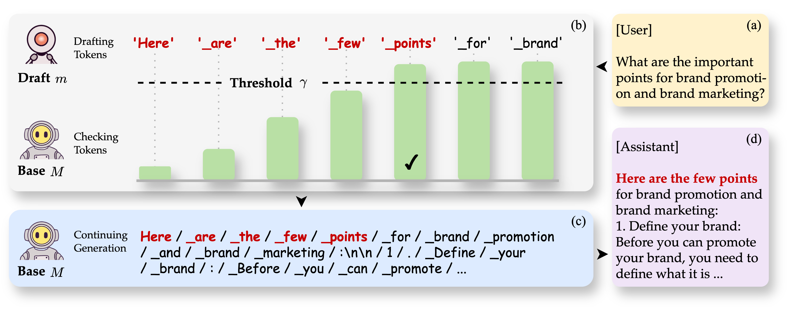

<h1 align="center">
    <br>Well Begun is Half Done: Low-resource Preference Alignment by Weak-to-Strong Decoding
</h1>
<p align="center">
    <a href="https://arxiv.org/abs/2506.07434">
        
    </a>
    <a href="https://huggingface.co/datasets/songff/GenerAlign">
        
    </a>
    <a href="https://huggingface.co/songff/Pilot-3B">
        
    </a>
    <a href="https://github.com/F2-Song/Weak-to-Strong-Decoding">
        
    </a>
</p>

<p align="center">
    Authors: Feifan Song, Shaohang Wei, Wen Luo, Yuxuan Fan, Tianyu Liu, Guoyin Wang and Houfeng Wang
</p>

## Overview
Large Language Models (LLMs) require alignment with human preferences to avoid generating offensive, false, or meaningless content. Recently, low-resource methods for LLM alignment have been popular, while still facing challenges in obtaining both high-quality and aligned content. Motivated by the observation that the difficulty of generating aligned responses is concentrated at the beginning of decoding, we propose a novel framework, Weak-to-Strong Decoding (WSD), to enhance the alignment ability of base models by the guidance of a small aligned model. The small model first drafts well-aligned beginnings, followed by the large base model to continue the rest, controlled by a well-designed auto-switch mechanism. We also collect a new dataset, GenerAlign, to fine-tune a small-sized Pilot-3B as the draft model, which effectively enhances different base models under the WSD framework to outperform all baseline methods, while avoiding degradation on downstream tasks, termed as the alignment tax. Extensive experiments are further conducted to examine the impact of different settings and time efficiency, as well as analyses on the intrinsic mechanisms of WSD in depth.

<p align="center">
    
</p>

## Easy Start
We prepare a script `scripts/exec.sh` for easy start. Before using it, you need to specify some parameters. Below is a sample:
```
id=exp_blabla
test_data_path=hh
draft_model_path=DRAFT_MODEL_PATH
draft_max_tokens=512
target_model_path=BASE_MODEL_PATH
target_max_tokens=2048

sh scripts/exec.sh \
    $id \
    $test_data_path \
    $draft_model_path \
    $draft_max_tokens \
    $target_model_path \
    $target_max_tokens
```
Then, just run the script:
```
bash scripts/exec.sh
```
To reproduce the results in the paper, you can use our trained model for draft, [Pilot-3B](https://huggingface.co/songff/Pilot-3B), as well as different base models.

## Training Draft Model
To help acquire draft models like Pilot-3B from scratch, we release a new dataset, [GenerAlign](https://huggingface.co/datasets/songff/GenerAlign), targetted for general preference alignment. Details can be found in [our paper](https://arxiv.org/abs/2506.07434).

We implement model training with [LLaMA-Factory](https://github.com/hiyouga/LLaMA-Factory), which is a powerful and easy-to-use framework.

## ⚠️Caution
The WSD framework, GenerAlign and Pilot-3B are proposed to promote the construction and development of safe AI systems, where the utilization of sensitive data cannot be avoided. However, it does not represent our attitudes and should be constrained to the purpose of only research, instead of arbitrary abuse or distribution. We also do not guarantee the safety of the generated content. Please use them at your own risk.

## Citation
If you find this work useful, please consider citing:
```
@misc{song2025well,
  title={Well Begun is Half Done: Low-resource Preference Alignment by Weak-to-Strong Decoding},
  author={Song, Feifan and Wei, Shaohang and Luo, Wen and Fan, Yuxuan and Liu, Tianyu and Wang, Guoyin and Wang, Houfeng},
  year={2025},
  eprint={2506.07434},
  archivePrefix={arXiv},
  primaryClass={cs.CL}
}
```